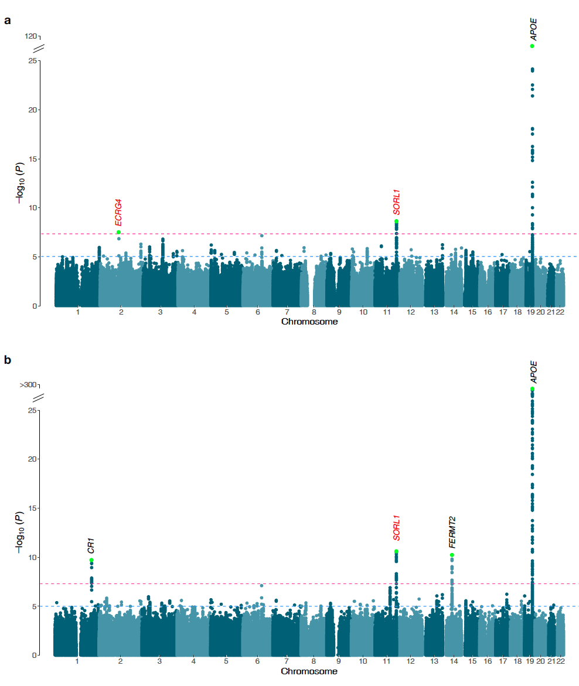

# AbetaGWAS_public_release

> This repository includes code and plots. Exploratory analysis and intermediate processing files are too large for this repository.

> The summary statistic are available from Zenodo at [link]. 

## Description

> A cross-ancestry GWAS meta-analysis of β-amyloid deposition in East Asian and European populations identified a novel SORL1 locus and highlighted its differential expression in microglia associated with β-amyloid positivity.

 

> Fig. 1. Manhattan plots of EAS and cross-ancestry meta-GWASs for Aβ deposition. a Manhattan plot of the GWAS meta-analysis for Aβ deposition in EAS (stage 1, n=3,855). b Manhattan plot of the cross-ancestry GWAS meta-analysis for Aβ deposition in EAS and EUR populations (n=15,701). P-values for GWASs were calculated using a fixed-effect inverse variance-weighted meta-analysis. The x axis represents chromosomal position, and the y axis represents the −log10(P-value) for the association of variants with Aβ deposition. Reported P-values are two-sided and not corrected for multiple testing. The light green dots represent the genome-wide significant lead variants. The red text highlights previously unreported loci along with their mapped genes, while the black text indicates previously reported loci. The pink and blue horizontal dashed lines indicate the genome-wide significance level (P-value=5.00×10-8) and the genome-wide suggestive level (P-value=1.00×10-5), respectively. EAS, East Asian; EUR, European; GWAS, genome-wide association study.

## scripts
> sciprts for Korean single-cell RNA sequencing dataset.  

## Authors

> Contributors names and contact info

- Hong-Hee Won (wonhh@skku.edu)

- Sang-Hyuk Jung (Sanghyuk.Jung@pennmedicine.upenn.edu)

- Beomjin Jang (beomjin.jang@skku.edu)

## Acknowledgments

* [hail](https://github.com/hail-is/hail)
* [METAL](https://genome.sph.umich.edu/wiki/METAL_Documentation)
* [COLOC](https://github.com/chr1swallace/coloc)
* [SCANPY](https://scanpy.readthedocs.io/en/stable/installation.html)
* [MAST](https://rglab.github.io/MAST/)
